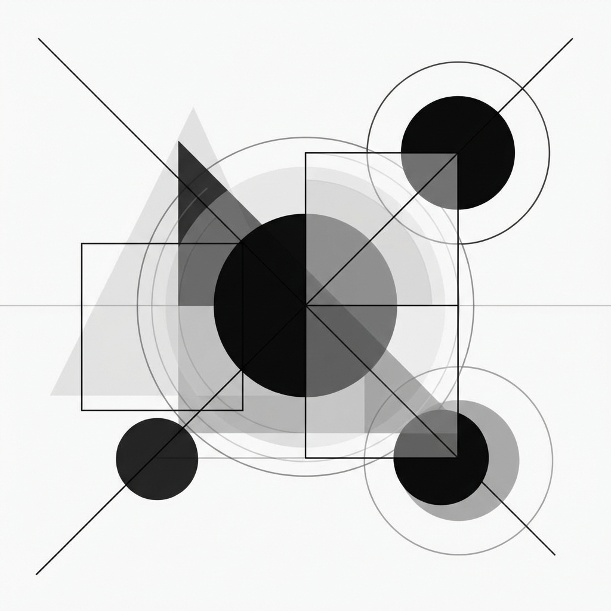

# Manus Works Collection



> AIエージェント「Manus」で作れるもの、すべて集めます。

**Manus Works Collection** は、AIエージェント「Manus」を使用して作成された成果物を集め、展示するためのイベントサイトです。
1週間のイベントを通じて、アプリ、ドキュメント、分析レポート、アート作品など、Manusの可能性を探求します。

## ✨ Event Overview

- **テーマ**: 7 Days, Infinite Possibilities, 1 Goal
- **期間**: 1 Week Event
- **募集カテゴリ**:
  - Apps & Tools
  - Documents
  - Data & Analysis
  - Creative

## 🛠 Tech Stack

- **Frontend**: HTML5, CSS3, Vanilla JavaScript
- **Fonts**: Noto Sans JP, Space Grotesk
- **Design**: Modern, Responsive, Interactive

## 🚀 Getting Started

このプロジェクトは静的なWebサイトです。ローカルで実行するには、任意のWebサーバーを使用してください。

```bash
# Example with python
python3 -m http.server 8000
```

or using `serve`:

```bash
npx serve .
```

## 📁 Project Structure

```
manus-lp/
├── index.html      # Main entry point
├── style.css       # Styles
├── script.js       # Interaction logic
└── .agent/         # GA-Workspace configuration
```

## 🤝 Contributing

This project is managed by **GA-Workspace**.

- Use `/create-feature` to start a new task.
- Use `/bug-fix` to resolve issues.

## 📜 License

[MIT](LICENSE)
